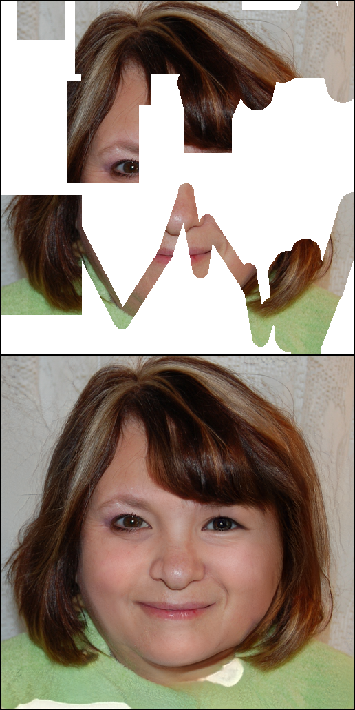

# CoModGAN /in PyTorch

Implementation of Large Scale Image Completion via Co-Modulated Generative Adversarial Networks (https://openreview.net/forum?id=sSjqmfsk95O) in PyTorch

## Notice

The implementation of this repo is heavily based on [@rosinality](rosinality)'s [stylegan2-pytorch](https://github.com/rosinality/stylegan2-pytorch). I recommend that the user read the original repo's README manual first.

Many features were *not* inherited from the original repo, including ADA and SWAGAN.

## Usage

First create lmdb datasets:

> python prepare_data.py --out LMDB_PATH --n_worker N_WORKER --size SIZE1,SIZE2,SIZE3,... DATASET_PATH

This will convert images to jpeg and pre-resizes it. This implementation does not use progressive growing, but you can create multiple resolution datasets using size arguments with comma separated lists, for the cases that you want to try another resolutions later.

Then you can train model in distributed settings

> python -m torch.distributed.launch --nproc_per_node=N_GPU --master_port=PORT train.py --batch BATCH_SIZE LMDB_PATH

train.py supports Weights & Biases logging. If you want to use it, add --wandb arguments to the script.

### Generate samples

> python generate.py --sample N_FACES --pics N_PICS --ckpt PATH_CHECKPOINT

You should change your size (--size 256 for example) if you train with another dimension.

## Samples

Sample from FFHQ. At 180,000 iterations.

## License

Model details and custom CUDA kernel codes are from official repostiories: https://github.com/NVlabs/stylegan2

Codes for Learned Perceptual Image Patch Similarity, LPIPS came from https://github.com/richzhang/PerceptualSimilarity

To match FID scores more closely to tensorflow official implementations, I have used FID Inception V3 implementations in https://github.com/mseitzer/pytorch-fid

@rosinality's StyleGANv2 Code: https://github.com/rosinality/stylegan2-pytorch

@zsyzzsoft's CoModGAN Code (Official): https://github.com/zsyzzsoft/co-mod-gan
